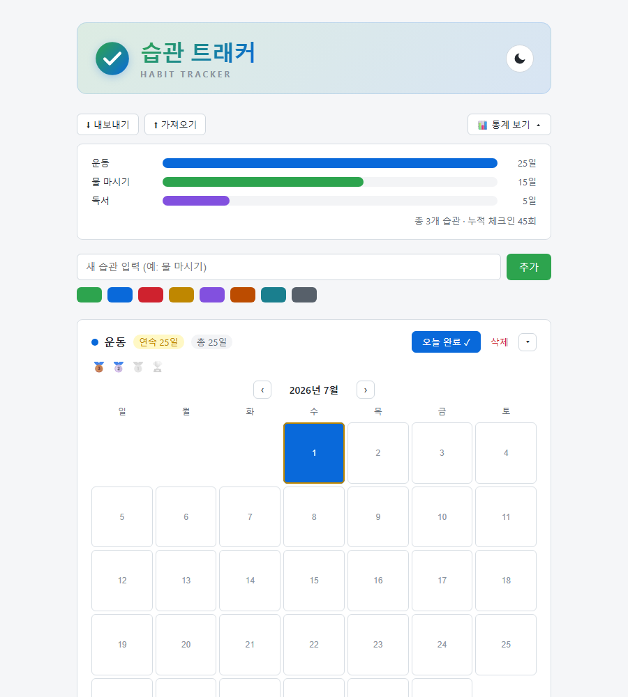
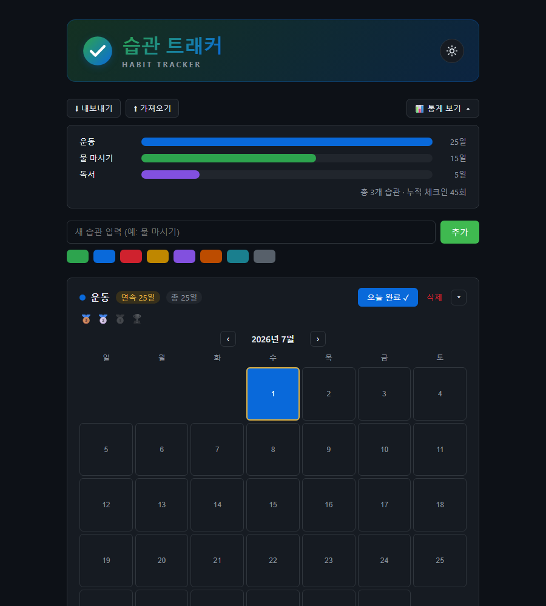

# 습관 트래커 (Habit Tracker)

매일의 습관을 기록하고 달력으로 확인할 수 있는 프론트엔드 전용 습관 트래커입니다. 백엔드/DB 없이 브라우저의 `localStorage`만으로 동작합니다.

## 스크린샷

|라이트 모드|다크 모드|
|---|---|
|||

## 주요 기능

- **습관 관리**: 습관 추가/삭제(실수 방지를 위한 삭제 확인), 이름·색상 수정
- **체크 & 달력**: 월별 캘린더에서 오늘은 물론 지난 날짜도 클릭해서 완료 체크 가능 (미래 날짜는 비활성화)
- **연속일수 & 총일수**: "연속 N일"과 "총 M일"을 함께 표시해 스트릭이 끊겨도 누적 기록이 보이도록 함
- **마일스톤 뱃지**: 역대 최장 연속기록이 7 / 21 / 66 / 100일을 넘으면 뱃지 획득
- **통계 대시보드**: 습관별 누적 완료일수를 막대그래프로 비교, 막대에 마우스를 올리면 연속·총일수 툴팁 표시, 클릭하면 해당 습관 달력으로 스크롤 이동
- **카드 접기/펼치기**: 습관이 많아져도 필요한 것만 펼쳐서 스크롤 부담을 줄임
- **다크 모드**: 시스템 설정을 기본값으로 사용하고, 토글로 직접 전환 가능 (선택값은 저장됨)
- **데이터 내보내기/가져오기**: JSON 파일로 백업하고 다시 불러올 수 있음

## 사용 방법

별도 빌드 과정이나 서버가 필요 없습니다. `index.html` 파일을 브라우저로 열면 바로 사용할 수 있습니다.

## 기술 스택

- HTML / CSS / JavaScript (바닐라, 프레임워크·라이브러리 없음)
- 데이터 저장은 브라우저 `localStorage` 사용
- 외부 API 없음

## 향후 계획

현재는 프론트엔드만으로 구성되어 있으며, 이후 Supabase + Vercel을 활용한 백엔드/배포 연동을 검토 중입니다.
